# 🥖 App Panificio - Frontend & Backend 🍞

## 📋 Descrizione Generale

Benvenuti nell'applicazione **Panificio**, un progetto full-stack progettato per digitalizzare l’esperienza di un panificio tradizionale e renderla accessibile anche online. 🍞

Questa applicazione consente ai clienti di:

- 🌐 Navigare il catalogo dei prodotti da forno, con immagini e descrizioni dettagliate
- 📆 Effettuare prenotazioni per acquistare prodotti in modo semplice
- 📩 Inviare messaggi per richiedere informazioni o assistenza

Nel frattempo, il personale del panificio (ADMIN) ha accesso a un'area riservata (Backoffice) per:

- 👨‍🍳 Gestire il catalogo dei prodotti
- 📥 Visualizzare e gestire le prenotazioni effettuate dai clienti
- 📬 Leggere e rispondere ai messaggi ricevuti

L’interfaccia frontend è sviluppata in **React** e comunica con il backend sviluppato in **Spring Boot**, ospitato nel repository [CapstonBackEndAF](https://github.com/annafirinu/CapstonBackEndAF).  
Il backend si occupa di tutte le funzionalità core, inclusa l’autenticazione e autorizzazione tramite **JWT**, la gestione dei dati tramite **PostgreSQL**, e l’invio automatico di email tramite **SMTP Gmail**.

Questa app è pensata per essere utilizzata sia su desktop che su dispositivi mobili, con un’interfaccia responsive, semplice e intuitiva. 💻📱

---

## 💻 Frontend

### ⚙️ Tecnologie Utilizzate

- ⚛️ React
- 🔗 Axios per le chiamate API
- 🧭 React Router per la navigazione

### 🗂️ Struttura e Pagine Principali

- 🏠 **Home:** Presenta una panoramica delle caratteristiche principali del panificio.
- 🛍️ **Prodotti:** Visualizza l'intero catalogo con possibilità di maggiori dettagli su ciascun prodotto.
- 🔍 **Dettaglio Prodotto:** Pagina dedicata alla visualizzazione delle informazioni dettagliate di un singolo prodotto.
- 📅 **Prenota:** Permette ai visitatori di effettuare una prenotazione.
- 🔐 **Login:** Form per l'accesso al sistema da parte dell'ADMIN (Panificio).
- 📬 **Contatti:** Permette ai visitatori di inviare un messaggio tramite email.
- 🛠️ **Backoffice:** Accessibile solo agli utenti con ruolo ADMIN, consente la gestione di prodotti, prenotazioni e messaggi.

### 🖼️ Screenshot

Di seguito alcuni screenshot delle pagine principali (inserire immagini nella cartella `/docs/screenshots`):

- 🏠 Home  
  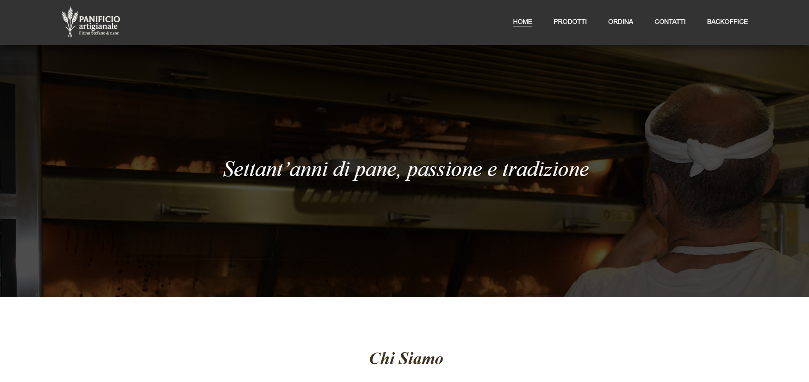  
  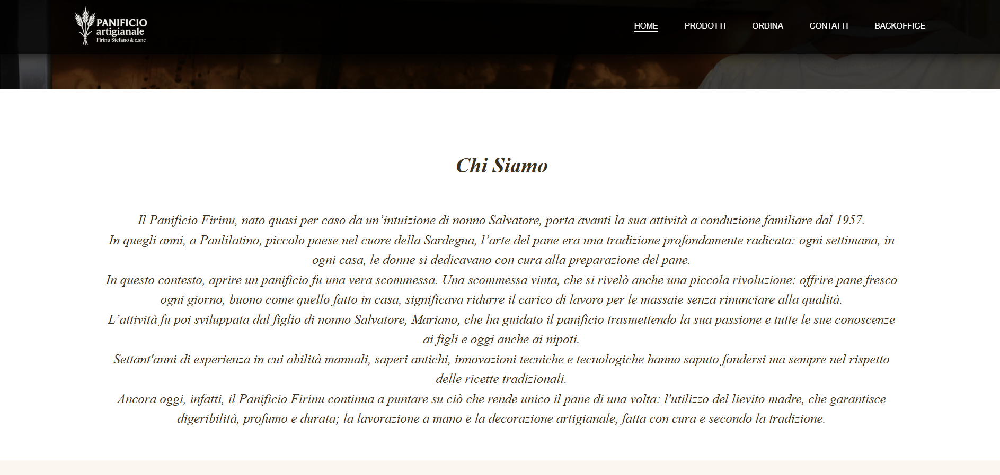  
  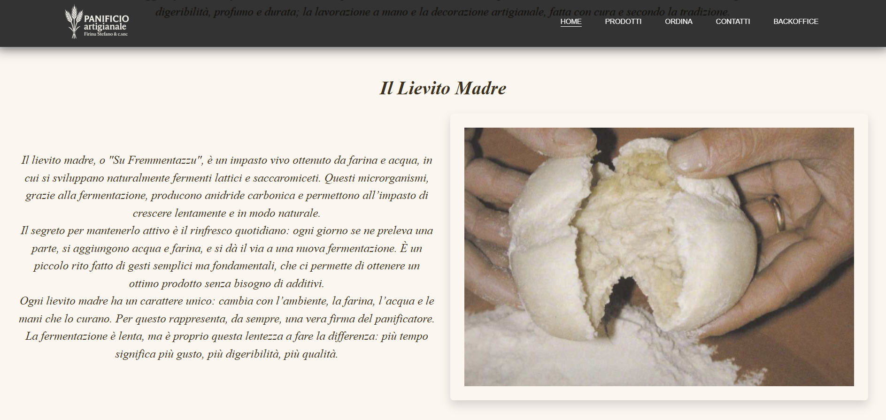  
  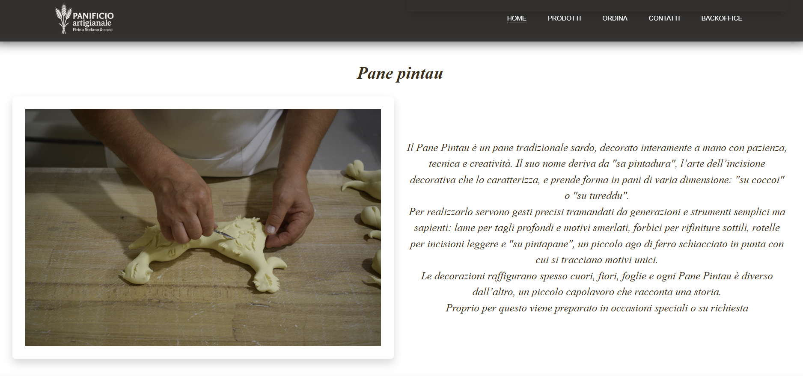  
  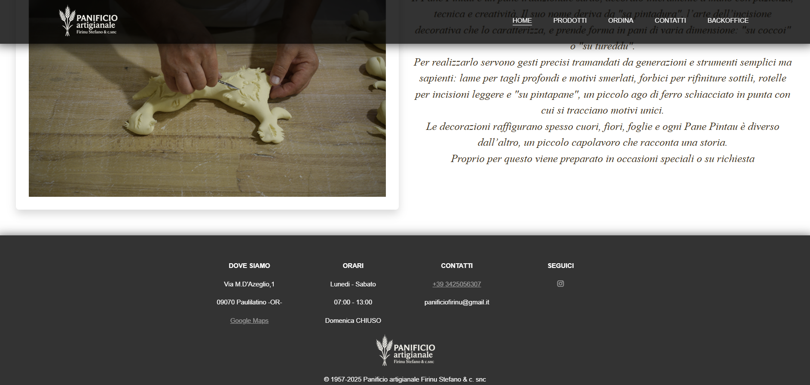

- 🛍️ Prodotti  
  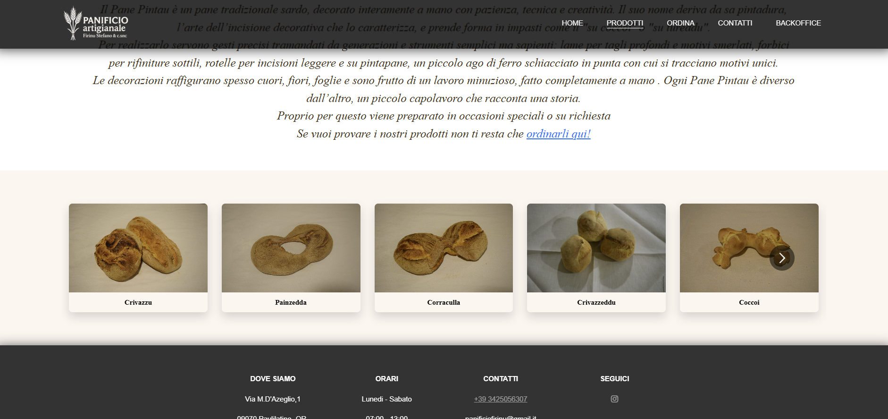

- 🔍 Dettaglio Prodotto  
  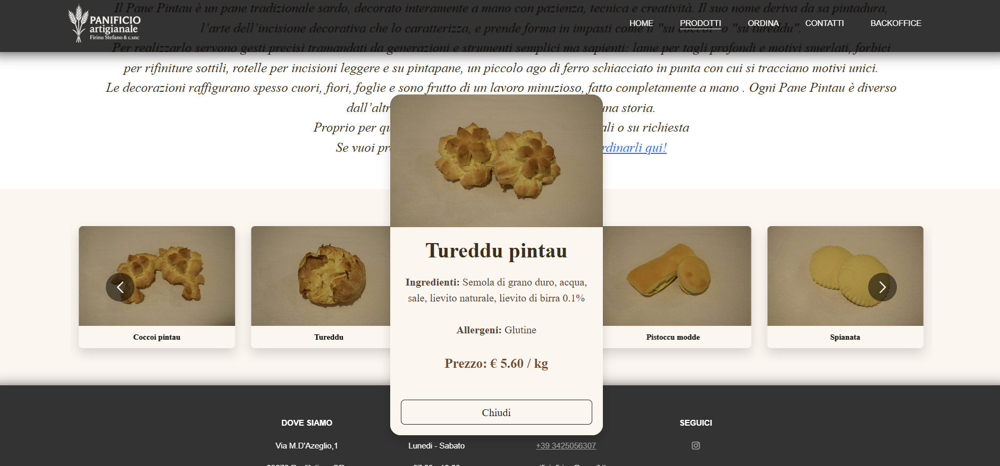

- 📅 Prenota
  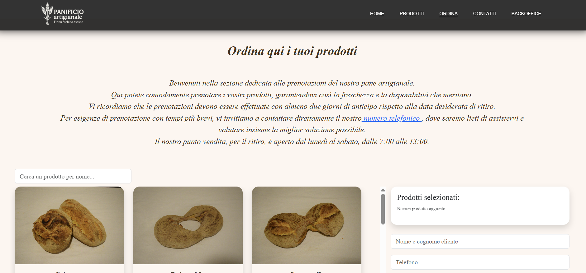  
  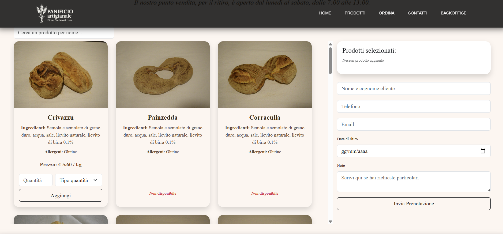

- 🔐 Login  
  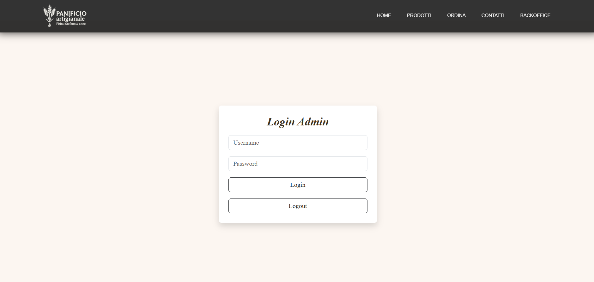

- 🛠️ Backoffice
  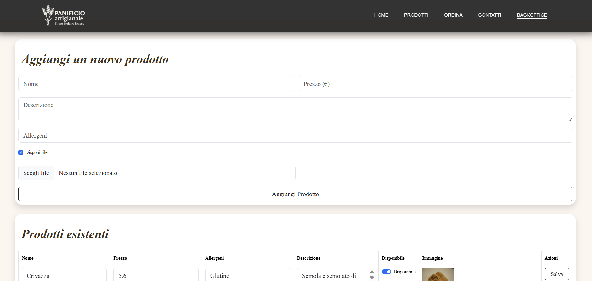  
  

---

### 🚀 Installazione

bash
npm install

### ▶️ Avvio

bash
npm run dev

## 🛠️ Backend

Il backend è ospitato in un progetto separato chiamato CapstonBackEndAF

È sviluppato con:

☕ Java, Spring Boot
🐘 PostgreSQL come database
🔐 Spring Security con JWT per autenticazione/autorizzazione
☁️ Cloudinary per gestione immagini
📧 SMTP Gmail per invio email

⚙️ Funzionalità principali:

👤 Registrazione e login utenti
🛡️ Ruoli utenti (ADMIN, UTENTE)
🛒 Gestione prodotti (CRUD)
📅 Prenotazioni pubbliche
✉️ Invio messaggi di contatto

🛠️ Installazione e avvio backend:

📥 Clonare il repository backend
⚙️ Configurare env.properties con:
postgresql.password = **_
cloud_name=_**
api*key=\*\**
api*secret=***
gmail.password = **_
gmail.from = _\*\*
🗄️ Creare il database PostgreSQL capstonefa
▶️ Avviare il backend

Il backend sarà disponibile su http://localhost:8080 🚀

🔄 Come far interagire frontend e backend:

✅ Assicurarsi che il backend sia in esecuzione e accessibile all'URL specificato nel file di configurazione frontend.
📡 Le chiamate API nel frontend usano Axios per inviare richieste HTTP al backend.
🔑 L'autenticazione utilizza token JWT: al login il backend restituisce un token che il frontend memorizza nel localStorage e invia in header Authorization nelle richieste protette.

🔗 Link ai repository
🧠 Backend: https://github.com/annafirinu/CapstonBackEndAF
💻 Frontend: https://github.com/annafirinu/CapstonFrontEndAF
